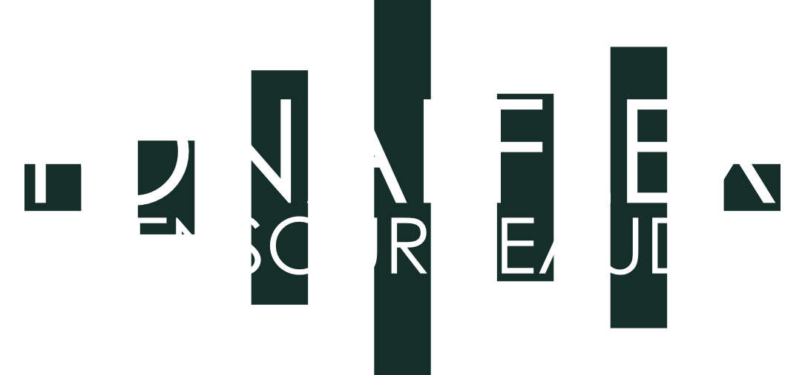

---

TonalFlex is an open-source project dedicated to making professional-grade audio processing more accessible, flexible, and cost-effective.

Using modern technologies like ElkOS, JUCE C++, and Bluetooth MIDI, we’re building real-time audio processing solutions that integrate seamlessly with wireless controllers and modern web-based UI-interfaces.

Our goal is to empower musicians, sound engineers, and developers with modular, adaptable tools for both live and studio environments.

Join us as we revolutionize audio processing with open-source innovation! 🚀 🎛️

---

## Environment Variables

You need to create a `.env` file in the root of this project and add:

```sh
DEVICE_IP=192.168.XX.XXX # Replace with actual device IP
```

## Project Rules

### Git Branches

In this project we apply the single rule of using developer initials plus feature name in kebab-case.

Feature Branch Examples:

```shell
st-plugins
rk-ui-bluetooth
st-core-app
rk-plugin-chorus
```

Any merge into the `main` branch must be made through a `Pull Request`.

### Commit Rules

All commits must:

1. **Be short and descriptive**: Clearly state the purpose of the commit.
2. **Use imperative mood**: Start with action verbs like "Add", "Fix", "Change", "Update" or "Refactor".
3. **Focus on one change**: Keep commits atomic and specific.
4. **Avoid large commits**: Break down large changes into smaller, logical commits to make them easier to review and understand.

### Pull Request Rules

1. **Keep it simple**: Focus on solving one issue or implementing one feature at a time.
2. **Write a clear title**: Summarize the purpose of the pull request in a single line.
3. **Link relevant issues**: Reference issues with `Fixes #<issue-number>` if applicable.
4. **Ensure readiness**: Verify that all tests pass and documentation is updated before submitting.

---

## The Problems We Want to Solve

Professional audio systems often come with significant limitations, including:

- **High Costs:** Many professional audio processing solutions are expensive and inaccessible for smaller studios or individual musicians.
- **Lack of Flexibility:** Proprietary systems often restrict customization and integration with external hardware or software.
- **Outdated Interfaces:** Many systems rely on built-in displays and fixed controls, lacking the flexibility of modern web-based or wireless interfaces.
- **Complexity of Setup:** Connecting controllers and managing configurations can be unnecessarily cumbersome, especially in dynamic live environments.
- **Closed Ecosystems:** Most high-end audio processing solutions are locked into vendor-specific hardware and software, limiting adaptability and innovation.

By addressing these issues, TonalFlex aims to create an open, modular platform that prioritizes flexibility, usability, and affordability.

---

## Licence

As per attached licence file.
